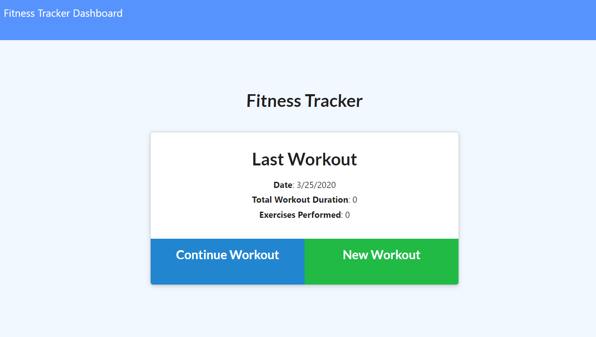
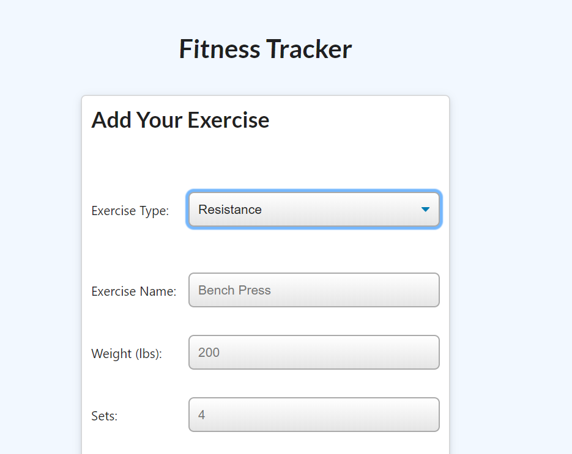

# track-your-workout
This is a workout tracker that uses a Mongo database with a Mongoose schema and handles routes with Express.

## Description

Users can view, create and track daily workouts, log multiple exercises in a workout on a given day. Users can also track the name, type, weight, sets, reps, and duration of exercise. For cardio exercise, users are able to track distance traveled.

## Deployed site
[Check it out here](https://pure-inlet-27177.herokuapp.com/)

